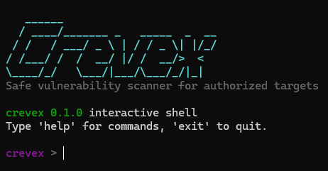

# Crevex

<p align="center">
  
</p>

Crevex is a safe Python CLI vulnerability scanner for authorized targets. It supports DAST-style web and host checks, source-code checks, an interactive terminal shell, and JSON/HTML reports with actionable remediation guidance.

Crevex is intended only for systems you own or are explicitly authorized to test.

## Features

- Interactive shell mode for running Crevex commands inside the tool.
- Safe web and host checks for running applications.
- Source-code checks for common project risks in JavaScript, Python, and PHP projects.
- Text, JSON, and HTML report output.
- Terminal output controls with `--quiet`, `--verbose`, and `--no-color`.
- Loading indicator with elapsed time while scans are running.
- Findings with evidence, impact, severity, confidence, and remediation guidance.
- Safe-by-default behavior with explicit authorization required for active scans.

## Quick Start

Run from source:

```powershell
$env:PYTHONPATH="src"
python -m crevex
```

Or install locally:

```powershell
python -m pip install -e .
crevex
```

## Interactive Shell

Run Crevex without arguments to open the interactive shell:

```powershell
crevex
```

Inside the shell, run commands without typing `crevex` again:

```text
crevex > checks
crevex > scan http://127.0.0.1:3000 --confirm-authorized
crevex > code-scan <project-path>
crevex > audit http://127.0.0.1:3000 --code-path <project-path> --confirm-authorized
crevex > exit
```

## CLI Usage

List available checks:

```powershell
crevex checks
```

Scan a running web application or host:

```powershell
crevex scan https://example.com --confirm-authorized
```

Use compact output:

```powershell
crevex scan https://example.com --confirm-authorized --quiet
```

Show extra finding metadata:

```powershell
crevex scan https://example.com --confirm-authorized --verbose
```

Disable terminal colors:

```powershell
crevex scan https://example.com --confirm-authorized --no-color
```

Disable the loading indicator:

```powershell
crevex scan https://example.com --confirm-authorized --no-spinner
```

Choose scan depth:

```powershell
crevex scan https://example.com --confirm-authorized --profile quick
crevex scan https://example.com --confirm-authorized --profile standard
crevex scan https://example.com --confirm-authorized --profile deep
```

Profile behavior:

- `quick`: small check set, common web ports, fast source-code checks.
- `standard`: balanced default for safe everyday scanning.
- `deep`: broader safe port and sensitive-path coverage.

Use a config file:

```powershell
crevex scan https://example.com --confirm-authorized --config crevex.yml
```

Crevex also reads `crevex.yml` from the current directory automatically when it exists. Use `crevex.example.yml` as a starting point.

Example:

```yaml
profile: standard
format: table
no_color: false
no_spinner: false
quiet: false
verbose: false

exclude_check:
  - web.sensitive_paths
```

Authorization is intentionally not read from config. Active scans still require `--confirm-authorized`.

Scan source code:

```powershell
crevex code-scan <project-path>
```

Run a combined DAST and source-code audit:

```powershell
crevex audit https://example.com --code-path <project-path> --confirm-authorized
```

Write a JSON report:

```powershell
crevex scan https://example.com --confirm-authorized --format json --output report.json
```

Render a saved JSON report as HTML:

```powershell
crevex report report.json --format html --output report.html
```

## Current Checks

DAST checks:

- DNS resolution summary.
- Safe TCP port exposure check on a small default port list.
- HTTP service detection before web-only checks.
- HTTP security headers.
- Cookie security flags.
- Common sensitive path exposure using safe GET requests.
- TLS certificate expiration.

Source-code checks:

- Dependency manifest discovery for JavaScript, Python, and PHP projects.
- Possible hardcoded secrets.
- Risky source patterns for SQL string building, debug mode, unsafe redirects, and command execution from input.

## Safety

The default scanner performs low-risk checks only. It does not exploit targets, brute-force credentials, or run destructive payloads.

Active scans require explicit authorization confirmation:

```powershell
crevex scan https://example.com --confirm-authorized
```
